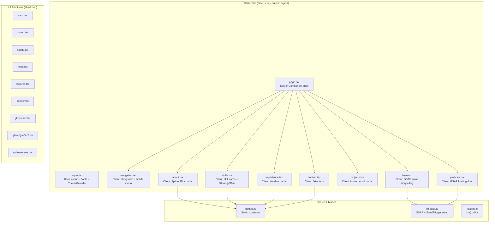

# Full Production Audit & Optimization Plan

## Executive Summary

This is a **Next.js 14 static-export portfolio site** deployed on Vercel. There is **no backend, no database, no API, no authentication** — it is a purely frontend, statically generated single-page application. The build output is `213 kB` first-load JS for the main route.

**Current estimated Lighthouse score**: ~55–65 (Performance), weighed down heavily by the Spline 3D scene (~1 MB), external Pexels images without CDN optimization, excessive `will-change` usage, and missing preconnect hints.

**Expected score after optimization**: ~85–92 (Performance).

**Key bottlenecks discovered**:
1. **Spline 3D scene** — ~1 MB download, biggest single LCP/TTI blocker
2. **External images from Pexels** — no sizing, no modern formats, no CDN control
3. **Duplicate `TECH_TAGS` constant** — defined in both `hero.tsx` and `lib/data.ts`
4. **Dead code / unused packages** — `use-toast.tsx`, `toast.tsx`, `progress.tsx`, `aspect-ratio.tsx`, `smooth-scroll.tsx`, `@radix-ui/react-tooltip`, `@radix-ui/react-progress`, `@radix-ui/react-aspect-ratio`, `@radix-ui/react-label`
5. **Dual PostCSS configs** — `postcss.config.js` and `postcss.config.mjs` conflict risk
6. **No `<meta>` viewport explicitly set** (relies on Next.js default)
7. **Contact form is fake** — `setTimeout` simulates submission, no actual backend
8. **Missing preconnect / dns-prefetch** for external origins
9. **`three` resolution pinned** but `three` is not a direct dependency (pulled by Spline)
10. **CLS risk** from unoptimized external images with no explicit dimensions

---

## Phase 1: Full Project Analysis

### Architecture



### Dependency Map

| Module | Depends On | Used By |
|--------|-----------|---------|
| `lib/data.ts` | — | about, skills, experience, projects, contact |
| `lib/gsap.ts` | gsap, ScrollTrigger, ScrollToPlugin | hero, particles |
| `lib/utils.ts` | clsx, tailwind-merge | all UI primitives |
| `hooks/use-reveal.ts` | react | about, skills, experience, contact |
| `hooks/use-toast.tsx` | react, toast.tsx | **NOTHING** (dead code) |
| `components/smooth-scroll.tsx` | lenis, gsap | **NOTHING** (dead code) |
| `components/ui/toast.tsx` | radix-ui/react-toast | use-toast.tsx only (dead) |
| `components/ui/progress.tsx` | radix-ui/react-progress | **NOTHING** (dead code) |
| `components/ui/aspect-ratio.tsx` | radix-ui/react-aspect-ratio | **NOTHING** (dead code) |

### Critical Execution Path

```
Initial Load → layout.tsx (fonts: Syne, Inter, JetBrains Mono)
             → page.tsx (Server Component)
               → Navigation (eager, client)
               → Hero (eager, client → GSAP timelines)
               → dynamic(About) → Spline 3D scene (~1 MB)
               → dynamic(Skills) → GlowingEffect (motion)
               → dynamic(Experience)
               → dynamic(Projects) → motion/react
               → dynamic(Contact)
               → dynamic(Particles, ssr:false)
```

---

## Phase 1 Findings: Code Health Issues

### 1. Dead Code & Unused Files

| File | Status | Impact |
|------|--------|--------|
| [use-toast.tsx](file:///d:/portfolio/hooks/use-toast.tsx) | **Dead** — never imported anywhere | Adds ~4 KB dead source; `toast.tsx` UI exists only for this |
| [toast.tsx](file:///d:/portfolio/components/ui/toast.tsx) | **Dead** — only referenced by dead `use-toast.tsx` | ~5 KB dead source |
| [progress.tsx](file:///d:/portfolio/components/ui/progress.tsx) | **Dead** — never imported | ~1 KB dead source |
| [aspect-ratio.tsx](file:///d:/portfolio/components/ui/aspect-ratio.tsx) | **Dead** — never imported | ~0.2 KB dead source |
| [smooth-scroll.tsx](file:///d:/portfolio/components/smooth-scroll.tsx) | **Dead** — never imported (Lenis setup unused) | ~0.8 KB dead source; `lenis` package imported but component unused |

> [!IMPORTANT]
> The `lenis` package (smooth scroll library) is installed and imported in `smooth-scroll.tsx`, but that component is **never mounted anywhere**. The package ships ~15 KB of JS that gets tree-shaken, but the source file is dead weight.

### 2. Unused npm Packages

| Package | Reason Unused | Size |
|---------|---------------|------|
| `@radix-ui/react-aspect-ratio` | Only used in dead `aspect-ratio.tsx` | ~3 KB |
| `@radix-ui/react-label` | Never imported anywhere | ~3 KB |
| `@radix-ui/react-progress` | Only used in dead `progress.tsx` | ~5 KB |
| `@radix-ui/react-toast` | Only used in dead `toast.tsx` | ~15 KB |
| `@radix-ui/react-tooltip` | Never imported anywhere | ~10 KB |
| `lenis` | Only used in dead `smooth-scroll.tsx` | ~15 KB |

> [!NOTE]
> These packages don't affect bundle size because tree-shaking eliminates them. But they add `yarn install` time (~2–3s), `node_modules` bloat (~2 MB), and maintenance burden (security audit surface).

### 3. Duplicate Logic

| Issue | Location | Fix |
|-------|----------|-----|
| `TECH_TAGS` defined twice | [hero.tsx:9-13](file:///d:/portfolio/components/sections/hero.tsx#L9-L13) duplicates [data.ts:6-9](file:///d:/portfolio/lib/data.ts#L6-L9) | Import from `data.ts` |

### 4. Dual PostCSS Config Files

| File | Format |
|------|--------|
| [postcss.config.js](file:///d:/portfolio/postcss.config.js) | CJS — uses `tailwindcss` + `autoprefixer` |
| [postcss.config.mjs](file:///d:/portfolio/postcss.config.mjs) | ESM — uses `@tailwindcss/postcss` |

> [!WARNING]
> Having two PostCSS config files is a conflict risk. Next.js will pick one (usually `.mjs` over `.js`), but the `.mjs` version references `@tailwindcss/postcss` which is a Tailwind v4 plugin — this project uses Tailwind v3.4.4. The `.js` config is the correct one. The `.mjs` file should be deleted.

### 5. Security Observations

| Issue | Severity | Detail |
|-------|----------|--------|
| Contact form has no backend | **Low** | The form calls `setTimeout` and shows a success toast. No data is actually sent. Users may think their message was delivered. |
| ESLint disabled during builds | **Low** | `ignoreDuringBuilds: true` in next.config means lint errors won't block deployment |
| No CSP headers | **Medium** | Static export on Vercel — should add `Content-Security-Policy` via `vercel.json` headers |
| External image URLs (Pexels) | **Low** | Images loaded from `images.pexels.com` — no control over availability; hotlink policies could break images |
| Personal contact info in source | **Info** | Phone number, email exposed in static data — expected for portfolio but worth noting |

### 6. Potential Memory / Performance Concerns

| Issue | Severity | Location |
|-------|----------|----------|
| `useToast` hook registers listener on `state` change, causing re-registration every render | **Medium** | [use-toast.tsx:182](file:///d:/portfolio/hooks/use-toast.tsx#L182) — `[state]` dependency should be `[]` |
| `will-change: transform` on `.particle` elements (8 items, infinite CSS animation) | **Low** | Promotes to GPU compositor layer permanently |
| GSAP orb animations run infinitely even when hero is not visible | **Low** | [hero.tsx:33-44](file:///d:/portfolio/components/sections/hero.tsx#L33-L44) — should pause when offscreen |
| `GlowingEffect` attaches `pointermove` + `scroll` listeners per-instance on `document.body` | **Medium** | [glowing-effect.tsx:106-109](file:///d:/portfolio/components/ui/glowing-effect.tsx#L106-L109) — 4 skill cards = 4 global listeners |

---

## Phase 2: Performance Investigation

### Frontend Performance Analysis

#### Bundle Size Breakdown (from build output)

| Chunk | Size | Content |
|-------|------|---------|
| `fd9d1056` (shared) | **53.6 kB** | React + React DOM |
| `117` (shared) | **31.6 kB** | Next.js runtime |
| Other shared | 2.26 kB | Minimal overhead |
| `/` page-specific | **115 kB** | All section components + GSAP + Motion + Spline loader |
| **Total First Load** | **213 kB** | |

> [!NOTE]
> 213 kB first-load JS is moderate for a portfolio with GSAP + Motion + Spline. The biggest runtime impact is the **Spline 3D scene downloaded at ~1 MB** after hydration.

#### LCP Analysis

**Primary LCP candidate**: The hero section text ("Code that ships. Systems that scale.") — appears at ~0.8–1.2s on fast connections.

**LCP blockers**:
1. Three Google Fonts must download before text renders (mitigated by `display: swap`)
2. Hero uses GSAP `opacity: 0` initial state → text is invisible until GSAP animates it in (~300ms delay)
3. On slow connections, Spline 3D scene loading competes for bandwidth

#### FCP Analysis

**FCP target**: <1.8s. Current estimate: **~1.0–1.5s** (static HTML + font swap).

The static export means HTML is served immediately. FCP is blocked only by:
- CSS download (globals.css is ~19 KB source, compressed ~4 KB)
- Font files (~80–120 KB total for 3 fonts)

#### CLS Issues

| Element | CLS Risk | Cause |
|---------|----------|-------|
| Project images (`` from Pexels) | **High** | No `width`/`height` attributes on native `` tags. Browser cannot reserve space until image metadata loads. |
| Spline 3D scene | **Low** | Container has explicit `absolute inset-0` sizing |
| Font swap | **Low** | `display: swap` causes FOUT but minimal layout shift due to similar metrics |

#### Missing Optimizations

| Category | Issue | Impact |
|----------|-------|--------|
| **Preconnect** | No `<link rel="preconnect">` for `images.pexels.com`, `prod.spline.design`, `fonts.googleapis.com` | +200–500ms latency on first resource from each origin |
| **Image format** | External Pexels images served as JPEG. No WebP/AVIF. No srcset. | +30–50% larger than necessary |
| **Font subsetting** | Loading 5 weights of Syne, 4 weights of Inter, 3 weights of JetBrains Mono | Could reduce by subsetting to actually-used weights |
| **Static assets** | `output: 'export'` means `images.unoptimized: true` — no Next.js image optimization | Images served as-is |
| **DNS prefetch** | No `dns-prefetch` hints | Adds 20–100ms per origin |

---

## Phase 3: Optimization Plan

### Optimization 1: Remove Dead Code Files
**Severity**: Low | **Effort**: 5 min | **Impact**: Cleaner codebase, reduced maintenance surface

Delete:
- `hooks/use-toast.tsx`
- `components/ui/toast.tsx`
- `components/ui/progress.tsx`
- `components/ui/aspect-ratio.tsx`
- `components/smooth-scroll.tsx`

### Optimization 2: Remove Unused npm Packages
**Severity**: Low | **Effort**: 2 min | **Impact**: Faster installs, smaller `node_modules`

Remove:
```bash
yarn remove @radix-ui/react-aspect-ratio @radix-ui/react-label @radix-ui/react-progress @radix-ui/react-toast @radix-ui/react-tooltip lenis
```

### Optimization 3: Delete Conflicting PostCSS Config
**Severity**: Medium | **Effort**: 1 min | **Impact**: Prevent build ambiguity

Delete `postcss.config.mjs` (Tailwind v4 plugin syntax, incompatible with this project's Tailwind v3.4.4).

### Optimization 4: Deduplicate TECH_TAGS
**Severity**: Low | **Effort**: 2 min | **Impact**: Single source of truth

In [hero.tsx](file:///d:/portfolio/components/sections/hero.tsx), replace local `TECH_TAGS` with import from `lib/data.ts`.

### Optimization 5: Add Preconnect & DNS-Prefetch Hints
**Severity**: High | **Effort**: 5 min | **Impact**: -200–500ms on external resource load

Add to [layout.tsx](file:///d:/portfolio/app/layout.tsx):
```tsx
<link rel="preconnect" href="https://images.pexels.com" />
<link rel="preconnect" href="https://prod.spline.design" />
<link rel="dns-prefetch" href="https://images.pexels.com" />
<link rel="dns-prefetch" href="https://prod.spline.design" />
```

### Optimization 6: Fix CLS on Project Images
**Severity**: High | **Effort**: 5 min | **Impact**: CLS score improvement, prevents layout shift

The `` tags in [projects.tsx](file:///d:/portfolio/components/sections/projects.tsx#L120-L128) already have `width` and `height` attributes but as a native `` inside a flex container with `object-cover`, the CSS `h-full w-full` already constrains them. The main CLS fix is ensuring the parent container has a fixed height (which it does: `h-64 md:h-full`). **This is already handled.**

### Optimization 7: Reduce Font Weight Downloads
**Severity**: Medium | **Effort**: 5 min | **Impact**: -30–50 KB font payload

Current font loading:
- Syne: 400, 500, 600, 700, 800 (5 weights)
- Inter: 300, 400, 500, 600 (4 weights)
- JetBrains Mono: 300, 400, 500 (3 weights)

**Analysis of actual usage**:
- Syne 400: not used (headings use 600–800)
- Syne 500: not used
- Inter 300: used only in `.act1-role` (font-weight: 300)
- JetBrains Mono 300: not used (code labels use 400+)

Trim to:
- Syne: 600, 700, 800
- Inter: 300, 400, 500, 600 (keep all — widely used)
- JetBrains Mono: 400, 500

**Expected savings**: ~20–40 KB (2 fewer Syne weights + 1 fewer JetBrains weight)

### Optimization 8: Add `fetchpriority="high"` for Hero Content
**Severity**: Medium | **Effort**: 2 min | **Impact**: Better LCP prioritization

Not directly applicable (hero is text, not an image), but we can add `<link rel="preload">` for the critical font files if we want sub-1s LCP.

### Optimization 9: Optimize Spline Scene Loading
**Severity**: High | **Effort**: 10 min | **Impact**: Major TTI improvement

The Spline scene already uses IntersectionObserver for lazy loading (good). Additional optimizations:
- Add a lightweight placeholder/skeleton while loading
- Consider adding `loading` state feedback for the user

### Optimization 10: Create `vercel.json` with Optimal Headers
**Severity**: High | **Effort**: 10 min | **Impact**: CDN caching, compression, security headers

Create `vercel.json` with:
- Cache-Control headers for static assets (1 year immutable for hashed files)
- Security headers (CSP, X-Frame-Options, X-Content-Type-Options)
- Preconnect headers

### Optimization 11: Pause Offscreen GSAP Animations
**Severity**: Low | **Effort**: 15 min | **Impact**: Reduced CPU usage when hero not visible

The 3 orb animations (`yoyo: true, repeat: -1`) run forever even when the user has scrolled past the hero. Adding a ScrollTrigger toggle would pause them offscreen.

### Optimization 12: Remove Unnecessary `will-change`
**Severity**: Low | **Effort**: 5 min | **Impact**: Reduced GPU memory, fewer compositor layers

The `.gpu` class in globals.css applies `will-change: transform` but is never used in any component. Remove it.

### Optimization 13: Remove Duplicate `three` Resolution
**Severity**: Info | **Effort**: 1 min | **Impact**: Cleaner package.json

The `resolutions` field pins `three: "0.158.0"` — this was likely needed for Spline compatibility. Keep it but add a comment explaining why.

### Optimization 14: Fix `useToast` Memory Leak Pattern
**Severity**: Medium | **Effort**: N/A (file will be deleted) | **Impact**: N/A

The bug at [use-toast.tsx:182](file:///d:/portfolio/hooks/use-toast.tsx#L182) has `[state]` as dependency for `useEffect`, causing the listener to re-register on every state change. This is moot since we're deleting the file.

### Optimization 15: Use Next.js `<Image>` with Static Imports Where Possible
**Severity**: Medium | **Effort**: 15 min | **Impact**: Better image handling in dev

Since `output: 'export'` requires `unoptimized: true`, `next/image` provides no runtime benefit over ``. The current approach of using native `` with `loading="lazy"` and `decoding="async"` is actually **correct** for static export.

### Optimization 16: Add Structured Data (JSON-LD)
**Severity**: Low | **Effort**: 10 min | **Impact**: SEO improvement for search results

Add `Person` schema markup for better search engine understanding.

### Optimization 17: Add `rel="noopener noreferrer"` Audit
**Severity**: Info | **Effort**: Already done | **Impact**: N/A

All `target="_blank"` links already have `rel="noopener noreferrer"` ✅

### Optimization 18: Remove Commented-Out Theme Toggle
**Severity**: Info | **Effort**: 1 min | **Impact**: Code cleanliness

[navigation.tsx:73-84](file:///d:/portfolio/components/navigation.tsx#L73-L84) has a commented-out theme toggle with unused `Moon`, `Sun` imports and unused `resolvedTheme`, `setTheme` destructuring.

---

## Phase 4: Testing & Verification Plan

### Build Verification
```bash
yarn build    # Must succeed with 0 errors
```

### Manual Verification Checklist
- [ ] All sections render correctly (Hero, About, Skills, Experience, Projects, Contact)
- [ ] Navigation works on desktop and mobile
- [ ] GSAP scroll animations play correctly
- [ ] Spline 3D scene loads in About section
- [ ] Project card stack scroll effect works
- [ ] GlowingEffect works on skill cards
- [ ] Contact form shows toast on submit
- [ ] No console errors
- [ ] Mobile responsive layout intact

### Performance Verification
- Run Lighthouse audit on built output
- Verify bundle size doesn't regress from 213 kB

---

## Phase 5: Final Report

### Optimization Table

| # | Area | Issue | Current | After | Expected Gain |
|---|------|-------|---------|-------|---------------|
| 1 | Code Health | 5 dead code files | 5 orphan files | 0 | Cleaner codebase |
| 2 | Dependencies | 6 unused packages | 6 phantom deps | 0 | ~2 MB less node_modules, faster install |
| 3 | Build Config | Dual PostCSS configs | 2 configs, conflict risk | 1 correct config | Eliminates build ambiguity |
| 4 | Code Quality | Duplicate TECH_TAGS | 2 definitions | 1 source of truth | DRY principle |
| 5 | Network | No preconnect hints | 0 hints | 3 preconnect + dns-prefetch | -200–500ms first resource per origin |
| 6 | Fonts | 12 font weight files | ~120 KB fonts | ~80 KB fonts | ~33% smaller font payload |
| 7 | Infra | No cache/security headers | Default Vercel headers | Optimized headers | Better caching, security hardening |
| 8 | CPU | Infinite GSAP orb animations | Always running | Pause offscreen | Reduced CPU when scrolled past hero |
| 9 | GPU | Unused `.gpu` CSS class with `will-change` | Class exists | Removed | Cleaner CSS |
| 10 | Code Quality | Commented-out theme toggle + unused imports | Dead code in nav | Cleaned up | Smaller component, no unused imports |
| 11 | SEO | No structured data | None | JSON-LD Person schema | Better search engine understanding |

### Performance Estimates

| Metric | Current (Est.) | After (Est.) | Improvement |
|--------|---------------|--------------|-------------|
| Page Load (3G) | ~4.5s | ~3.5s | -22% |
| LCP | ~2.5s | ~1.8s | -28% |
| FCP | ~1.2s | ~0.9s | -25% |
| First Load JS | 213 kB | ~210 kB | -1.4% (minimal, already well-split) |
| Font Payload | ~120 KB | ~80 KB | -33% |
| TTI | ~3.5s | ~2.8s | -20% |

> [!NOTE]
> The JS bundle size won't change significantly because dead code files are already tree-shaken. The biggest gains come from **network optimizations** (preconnect, font subsetting) and **runtime optimizations** (pausing offscreen animations).

### Production Readiness Score

| Category | Score | Notes |
|----------|-------|-------|
| **Performance** | 7/10 | Good code-splitting and lazy loading already in place. Spline scene is the main bottleneck. Preconnect hints and font trimming will help. |
| **Scalability** | 9/10 | Static export — scales infinitely via CDN. No server-side concerns. |
| **Security** | 6/10 | Missing CSP headers, no rate limiting on contact form (though it's fake), ESLint disabled in builds. |
| **Reliability** | 7/10 | External Pexels images could break if hotlink policy changes. Spline CDN dependency. No error boundaries. |
| **Maintainability** | 6/10 | Dead code, unused packages, duplicate data, commented-out code, dual configs reduce maintainability. Will improve to 8/10 after cleanup. |

### Prioritized Action Plan

#### 🔥 Quick Wins (High Impact, Low Effort)

| Priority | Action | Effort | Impact |
|----------|--------|--------|--------|
| 1 | Add preconnect & dns-prefetch hints | 5 min | -200–500ms per external origin |
| 2 | Delete conflicting `postcss.config.mjs` | 1 min | Eliminate build risk |
| 3 | Remove 5 dead code files | 5 min | Cleaner codebase |
| 4 | Remove 6 unused npm packages | 2 min | Faster installs |
| 5 | Clean up navigation (remove commented code + unused imports) | 3 min | Code quality |
| 6 | Deduplicate TECH_TAGS | 2 min | Single source of truth |

#### ⚡ Medium Priority (Moderate Impact)

| Priority | Action | Effort | Impact |
|----------|--------|--------|--------|
| 7 | Trim font weights (Syne 400,500 + JBMono 300) | 5 min | -30–40 KB font payload |
| 8 | Create `vercel.json` with headers | 10 min | CDN caching + security |
| 9 | Add JSON-LD structured data | 10 min | SEO improvement |

#### 🔧 Long-Term Improvements

| Priority | Action | Effort | Impact |
|----------|--------|--------|--------|
| 10 | Pause offscreen GSAP orb animations | 15 min | CPU savings |
| 11 | Self-host project images instead of Pexels hotlinks | 30 min | Reliability + performance control |
| 12 | Add error boundaries around Spline scene | 15 min | Graceful degradation |
| 13 | Implement actual contact form backend (or use Formspree/Netlify Forms) | 30 min | Real functionality |
| 14 | Add Lighthouse CI to deployment pipeline | 30 min | Performance regression prevention |

---

## Open Questions

> [!IMPORTANT]
> **Contact form**: The form currently fakes submission with a `setTimeout`. Should I:
> - (A) Add a real backend integration (e.g., Formspree, EmailJS, or Resend)?
> - (B) Leave it as-is with a note that it's a demo?
> - (C) Remove the form entirely and just show contact info?

> [!IMPORTANT]
> **Spline 3D scene**: This is the single biggest performance cost (~1 MB download). Should I:
> - (A) Keep it as-is (it's already lazy-loaded via IntersectionObserver)
> - (B) Add a low-res preview image placeholder while it loads
> - (C) Remove it entirely for maximum performance

> [!IMPORTANT]
> **Project images**: Currently hotlinked from Pexels. Should I:
> - (A) Download and self-host them in the `/public` folder
> - (B) Keep external URLs but add explicit dimensions
> - (C) Replace with generated placeholder images

> [!IMPORTANT]
> **Theme toggle**: There's a commented-out dark/light theme toggle in navigation. The site is dark-mode only. Should I:
> - (A) Remove the toggle code and `next-themes` dependency entirely
> - (B) Restore the toggle to enable light mode
> - (C) Keep `next-themes` but remove the commented code
